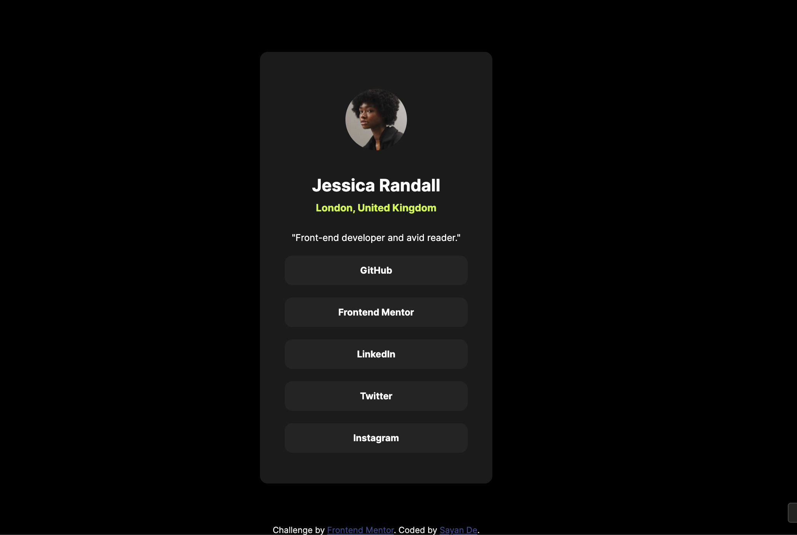

# Frontend Mentor - Social links profile solution

This is a solution to the [Social links profile challenge on Frontend Mentor](https://www.frontendmentor.io/challenges/social-links-profile-UG32l9m6dQ). Frontend Mentor challenges help you improve your coding skills by building realistic projects.

## Table of contents

- [Frontend Mentor - Social links profile solution](#frontend-mentor---social-links-profile-solution)
  - [Table of contents](#table-of-contents)
  - [Overview](#overview)
    - [The challenge](#the-challenge)
    - [Screenshot](#screenshot)
    - [Links](#links)
  - [My process](#my-process)
    - [Built with](#built-with)
    - [What I learned](#what-i-learned)
    - [Continued development](#continued-development)
    - [Useful resources](#useful-resources)
  - [Author](#author)

## Overview

### The challenge

Users should be able to:

- See hover and focus states for all interactive elements on the page

### Screenshot

### Links

- Solution URL: [Add solution URL here](https://your-solution-url.com)
- Live Site URL: [Add live site URL here](https://your-live-site-url.com)

## My process

### Built with

- Semantic HTML5 markup
- CSS custom properties
- Flexbox
- Mobile-first workflow

### What I learned

I was trying to use min-width and max-width together. Turns out that might not work correctly.

### Continued development

For the social links, I am thinking of using a fake api using json-server to fetch the link data and use React for frontend.

### Useful resources

- [How to use downloaded custom fonts](https://www.google.com/search?q=how+to+use+a+downloaded+font+css) - This helped me use the downloaded font correctly.

## Author

- Website - [Add your name here](https://www.your-site.com)
- Frontend Mentor - [@RoosterRoo](https://www.frontendmentor.io/profile/RoosterRoo)
